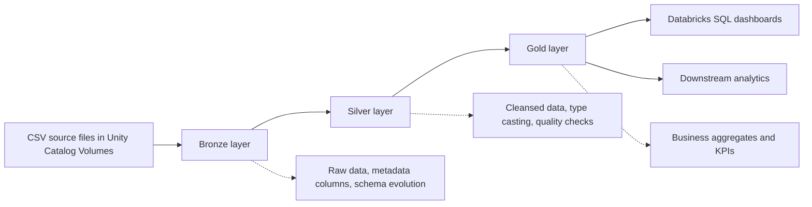
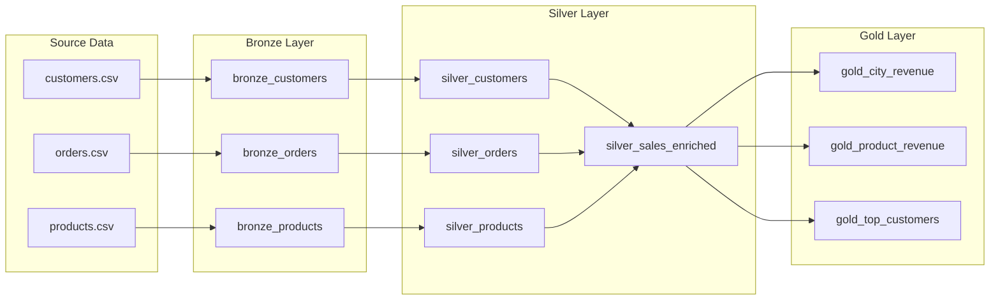
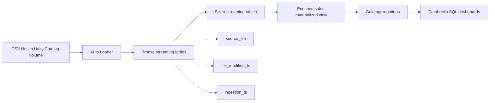
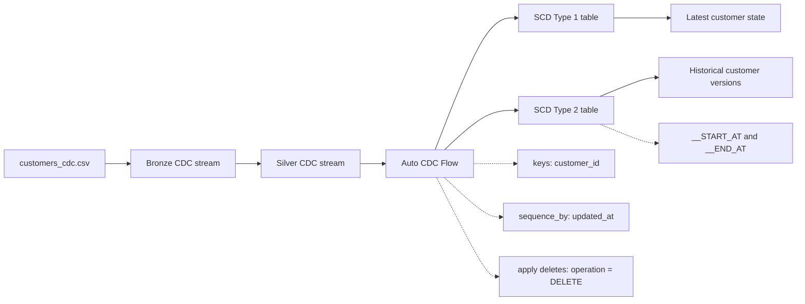
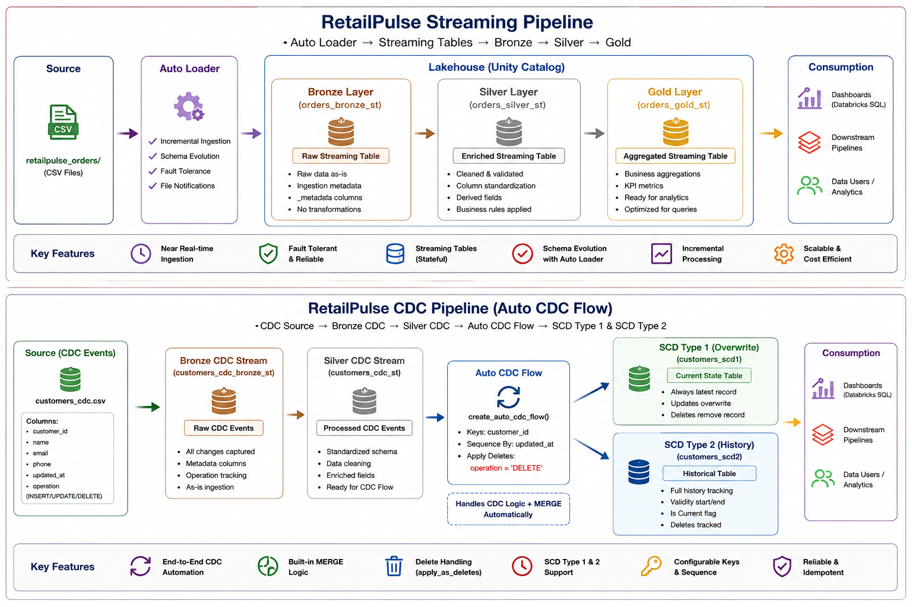

# RetailPulse Lakehouse Pipeline

End-to-end Databricks Lakehouse portfolio project covering Delta Lake, Lakeflow Declarative Pipelines, Auto Loader streaming ingestion, CDC processing, and SCD Type 1 / Type 2 patterns.

This repository is designed as a practical Data Engineering learning project and interview showcase. It demonstrates how raw retail data can move through a medallion architecture from Bronze ingestion to Silver validation and Gold analytics-ready aggregates.

## Repository Status

| Area | Status |
| --- | --- |
| Delta Lake fundamentals | Documented with SQL examples |
| Lakeflow batch pipeline | Reference implementation included |
| Streaming pipeline | Project script included |
| CDC pipeline | Project script included |
| Architecture diagrams | Mermaid diagrams included |
| Screenshots | Placeholder section plus supplied architecture image |

## Project Goal

Build a Databricks Lakehouse project that demonstrates:

- Delta Lake table operations and optimization
- Lakeflow Declarative Pipelines for batch and streaming transformations
- Auto Loader ingestion from Unity Catalog Volumes
- Medallion architecture using Bronze, Silver, and Gold layers
- Data quality expectations and validation
- CDC ingestion and processing with `create_auto_cdc_flow()`
- SCD Type 1 and SCD Type 2 table design

## Architecture Overview



## Phase 1 - Delta Lake Fundamentals

This phase covers core Delta Lake operations used in reliable lakehouse pipelines.

- Delta Tables
- `MERGE`
- `UPDATE`
- `DELETE`
- `DESCRIBE HISTORY`
- Time Travel
- `RESTORE`
- `OPTIMIZE`
- `VACUUM`

Reference file:

- `src/delta_lake/delta_lake_fundamentals.sql`

## Phase 2 - Lakeflow Declarative Pipelines Batch

### Bronze Layer

- `customers`
- `orders`
- `products`

### Silver Layer

- Data standardization
- Type casting
- Data quality expectations
- Data validation

### Gold Layer

- City Revenue
- Product Revenue
- Top Customers

### Batch Pipeline Diagram



Reference file:

- `src/lakeflow/batch/retailpulse_batch_pipeline.py`

## Phase 3 - Streaming Pipeline

The streaming pipeline ingests CSV files from Unity Catalog Volumes using Auto Loader and processes them through the medallion architecture.

### Source

- CSV files landing in Unity Catalog Volume
- Example paths:
  - `/Volumes/workspace/retailpulse_project/retailpulse_stream/customers`
  - `/Volumes/workspace/retailpulse_project/retailpulse_stream/orders`
  - `/Volumes/workspace/retailpulse_project/retailpulse_stream/products`

### Features

- Auto Loader
- Streaming Tables
- Metadata columns
- `ingestion_ts`
- `source_file`
- `file_modified_ts`

### Streaming Pipeline Diagram



Reference file:

- `src/lakeflow/streaming/retailpulse_streaming_pipeline.py`

## Phase 4 - CDC Pipeline

The CDC pipeline ingests customer change events and applies them to SCD Type 1 and SCD Type 2 target tables using Lakeflow Auto CDC.

### Source

`customers_cdc.csv`

Columns:

- `customer_id`
- `name`
- `city`
- `operation`
- `updated_at`

### Features

- Auto Loader CDC ingestion
- CDC event processing
- `create_auto_cdc_flow()`
- SCD Type 1
- SCD Type 2
- Delete handling
- Sequence by logic using `updated_at`

### CDC Pipeline Diagram



Reference file:

- `src/lakeflow/cdc/retail_pulse_cdc_pipeline.py`

## Technologies Used

- Databricks
- Delta Lake
- Lakeflow Declarative Pipelines
- Apache Spark Structured Streaming
- PySpark
- Auto Loader
- Unity Catalog
- Unity Catalog Volumes
- Databricks SQL
- GitHub
- Mermaid

## Project Structure

```text
retailpulse-lakehouse-pipeline/
|-- README.md
|-- LICENSE
|-- .gitignore
|-- assets/
|   `-- screenshots/
|       |-- retailpulse-streaming-cdc-architecture.png
|       `-- README.md
|-- data/
|   `-- sample/
|       `-- README.md
|-- docs/
|   |-- architecture.md
|   |-- phase-1-delta-fundamentals.md
|   |-- phase-2-lakeflow-batch.md
|   |-- phase-3-streaming-pipeline.md
|   |-- phase-4-cdc-scd.md
|   |-- repository-metadata.md
|   `-- setup-guide.md
|-- notebooks/
|   `-- README.md
`-- src/
    |-- delta_lake/
    |   `-- delta_lake_fundamentals.sql
    `-- lakeflow/
        |-- batch/
        |   `-- retailpulse_batch_pipeline.py
        |-- cdc/
        |   `-- retail_pulse_cdc_pipeline.py
        `-- streaming/
            `-- retailpulse_streaming_pipeline.py
```

## Screenshots

Add screenshots from Databricks after running the project:

- Lakeflow pipeline DAG
- Bronze, Silver, and Gold tables in Unity Catalog
- Data quality expectation results
- Streaming pipeline event log
- CDC SCD1 target table
- CDC SCD2 target table with historical versions
- Databricks SQL dashboard

Included architecture image:



More screenshot placeholders are available in `assets/screenshots/README.md`.

## Learning Outcomes

By completing this project, I practiced how to:

- Build a medallion architecture in Databricks
- Ingest batch and streaming files into Delta tables
- Use Auto Loader for scalable incremental ingestion
- Add metadata columns for observability and lineage
- Apply data quality expectations in Lakeflow pipelines
- Create Silver standardized tables from raw Bronze data
- Build Gold materialized views for analytics
- Implement CDC with Lakeflow Auto CDC
- Compare SCD Type 1 and SCD Type 2 behavior
- Use Delta Lake history, time travel, restore, optimize, and vacuum
- Structure a Data Engineering project for GitHub and portfolio review

## How To Run

1. Create a Databricks workspace with Unity Catalog enabled.
2. Create a catalog/schema for the project, for example `workspace.retailpulse_project`.
3. Create Unity Catalog Volumes for source files.
4. Upload sample CSV files into the correct volume paths.
5. Create Lakeflow Declarative Pipelines in Databricks.
6. Attach the relevant Python pipeline file from `src/lakeflow`.
7. Run the pipeline and inspect the DAG, event logs, and generated tables.
8. Query Gold tables in Databricks SQL.

More details are in `docs/setup-guide.md`.

## Professional Repository Description

Databricks Lakehouse portfolio project implementing Delta Lake, Lakeflow Declarative Pipelines, Auto Loader streaming ingestion, CDC, and SCD Type 1 / Type 2 patterns for a retail analytics use case.

## Suggested GitHub Topics

`databricks`, `delta-lake`, `lakehouse`, `lakeflow`, `pyspark`, `spark-structured-streaming`, `auto-loader`, `unity-catalog`, `cdc`, `scd-type-2`, `data-engineering`, `medallion-architecture`

## Reference

Earlier project reference:

- [isulai/medallion-lakehouse-pipeline-retailpulse](https://github.com/isulai/medallion-lakehouse-pipeline-retailpulse)

## License

This project is licensed under the MIT License. See `LICENSE` for details.
