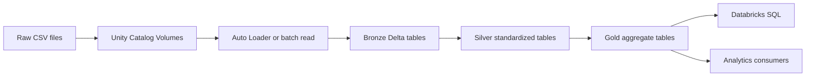
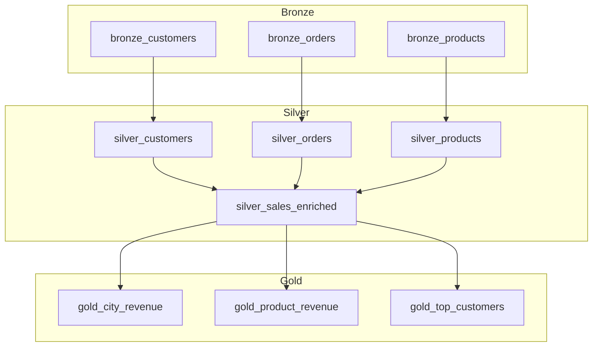
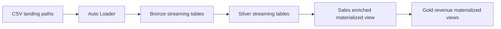
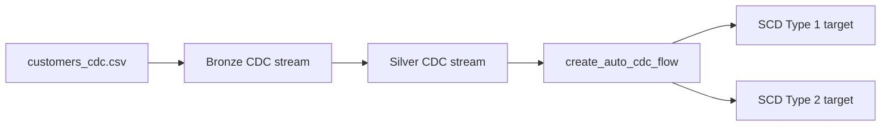

# Architecture

RetailPulse follows a medallion architecture using Bronze, Silver, and Gold layers. The project includes batch, streaming, and CDC patterns so the same retail domain can be explored through multiple Databricks pipeline styles.

## End-to-End Lakehouse

## Batch Pipeline

## Streaming Pipeline

## CDC Pipeline

## Data Quality Strategy

- Bronze keeps data close to the original source with ingestion metadata.
- Silver applies schema standardization, casts, validation, and quality expectations.
- Gold stores business-facing aggregations ready for BI and dashboarding.

## Operational Metadata

Streaming and CDC ingestion add metadata columns for observability:

- `ingestion_ts`
- `source_file`
- `file_modified_ts`
